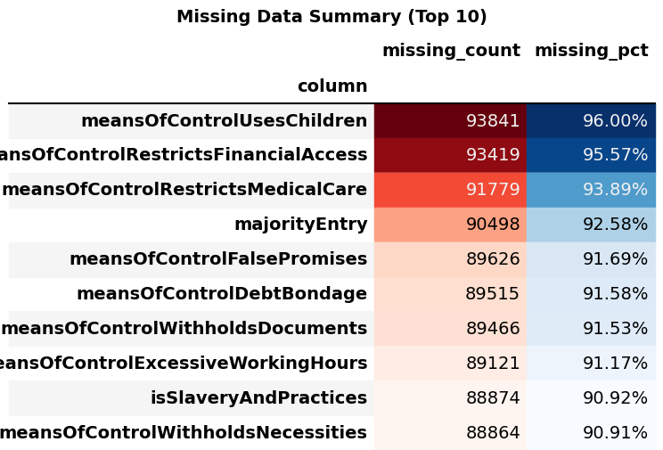
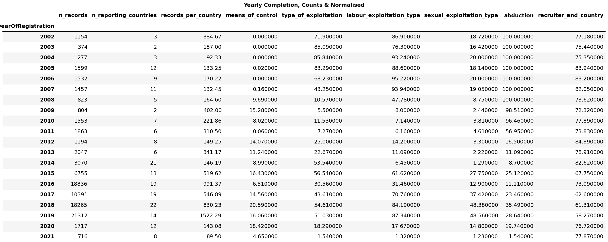
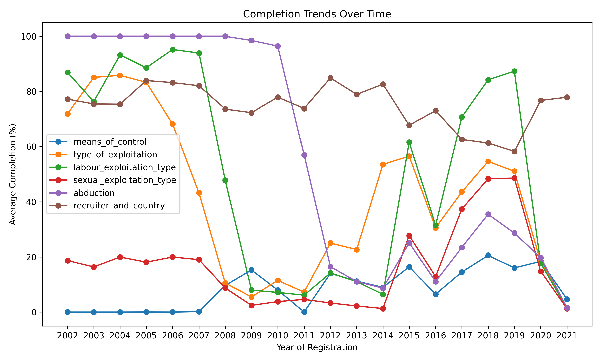
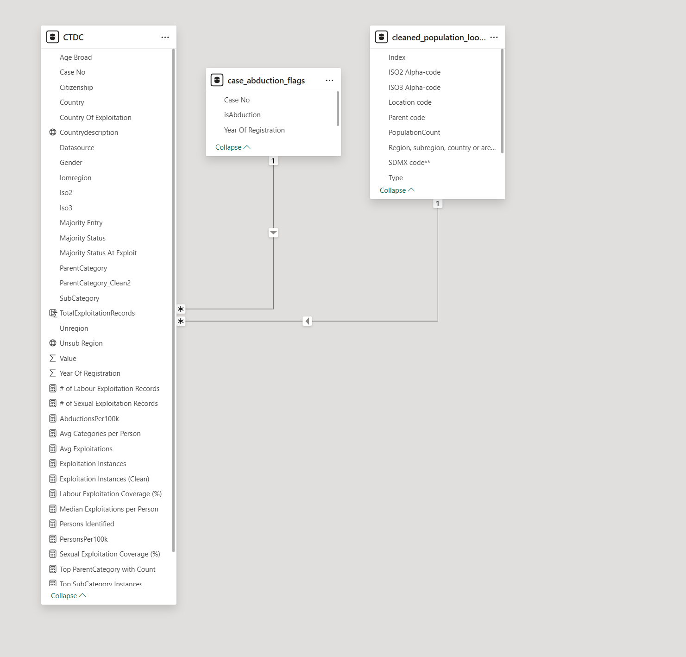
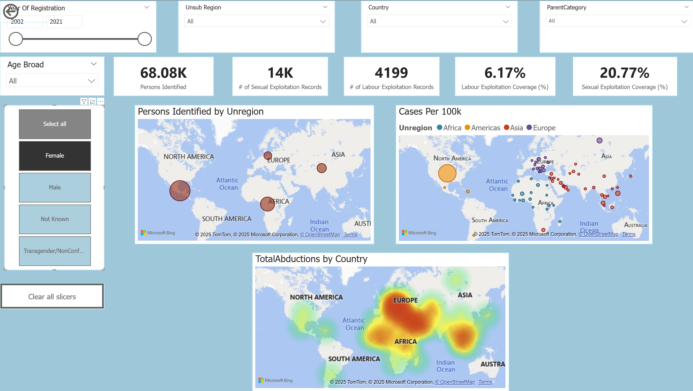
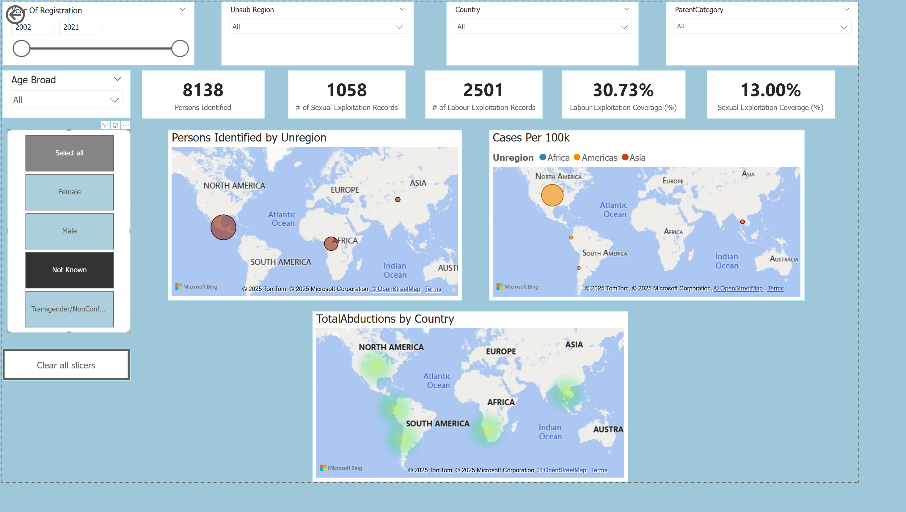
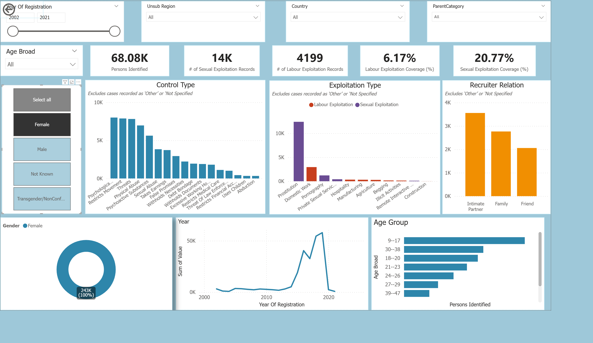
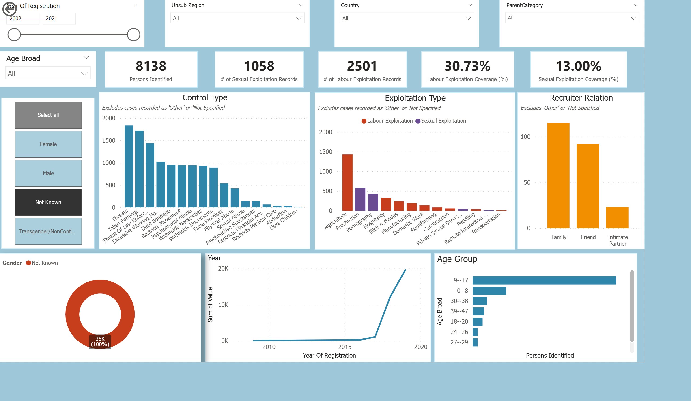

# 📊 CTDC Human Trafficking Analysis & Power BI Dashboard

### 🔎 Executive Summary
This project delivers a **transparent, end‑to‑end data pipeline** for the *Counter‑Trafficking Data Collaborative (CTDC)* dataset, combining **Python auditing** with **Power BI dashboards**. The workflow surfaces three critical insights:  
- **Scale**: reporting expanded sharply after 2014, but contributions per country remained uneven.  
- **Gaps**: over 85% missingness in key exploitation/control fields highlights structural weaknesses in data capture.  
- **Patterns**: gender‑split dashboards reveal distinct exploitation pathways — females more often in sexual exploitation under psychological control, males in labour exploitation under physical/economic coercion.  

By pairing **absolute counts, per‑capita rates, and coverage indicators**, the project demonstrates how reproducible analytics can turn a messy humanitarian dataset into **actionable evidence for governance, policy, and prevention**.

---

### 🚀 Project Highlights
- **Tech stack**: Python (Pandas, Matplotlib, Excel export), Power BI (DAX, data modelling), GitHub for version control  
- **Data engineering**: reshaped ~97k × 64 CTDC dataset into BI‑friendly long format; integrated UN population data for per‑capita normalisation  
- **Audit outputs**: styled Excel/CSV summaries, PNG charts of missingness, record counts, and year‑on‑year reporting trends  
- **Dashboards**: interactive Power BI visuals with gender filters, maps, and per‑100k case rates  
- **Impact**: highlights structural data gaps, gendered exploitation patterns, and governance recommendations  

---

## 1. 🎯 Project Objectives
- Audit the CTDC dataset for **missingness and completeness**  
- Reshape the data into a **long format** suitable for BI tools  
- Integrate **UN population data** to normalise case counts per 100k population  
- Build **Power BI dashboards** that balance absolute counts, per‑capita rates, and coverage indicators  
- Provide **insights by gender, age, region, and exploitation type**  
- Recommend **governance and standardisation steps** for future data collection  

---

## 2. 📂 Repository Structure
```
ctdc_analysis/
│
├── data/                  # Raw CTDC + UN population files
│   └── outputs/           # Cleaned population lookup
│
├── outputs/               # Audit summaries, CSVs, styled Excel, plots
│   └── samples/           # Lightweight sample CSVs for demo/testing
│
├── power_bi/              # Power BI dashboards (.pbix) and screenshots
│
├── ctdc_analysis.ipynb    # Python notebook for audit + reshaping
├── README.md              # This document
```

---

## 3. 🧹 Data Audit (Python)
- **Initial load**: ~97k rows × 64 columns. Added a stable `CaseID`.  
- **Missingness audit**:  
  - Dropped boilerplate “Terms of Use” column  
  - Computed missing counts/percentages for all fields  
  - Exported styled Excel + CSV summaries  
- **Group completeness**: Defined logical subgroups (Demographics, Control, Exploitation, Recruiter, Abduction).  
  - Found **>85% missingness** in many control/exploitation fields  
  - Demographics relatively complete  

📸 Audit Outputs:  
- [Missingness summary (Excel)](outputs/missing_summary_styled.xlsx)  
-   
-   
  *Insight: A small set of fields drives most missingness — clear targets for governance fixes.*  
-   
  *Insight: Case volumes rise sharply post‑2014, but growth is uneven across sources.*  
-   
  *Insight: Year‑on‑year reporting fluctuates, with recent years showing both higher totals and higher missingness rates.*  

---

## 4. 📈 Completeness & Reporting Trends
- Subgroup completeness tracked by **source and country**  
- **Key findings**:  
  - Early years: exploitation types fairly strong, control data absent  
  - Mid‑2010s: improved labour exploitation reporting  
  - Recent years: collapse in completeness across most groups  
  - Country coverage uneven (e.g. Egypt, India, Kenya strong; Lebanon, Belarus patchy)  

📸 Outputs:  
-   
-   

*Insight*: Reporting expanded sharply after 2014, but **normalised counts show that the average country’s contribution remained uneven**, highlighting structural gaps in data collection.

---

## 5. 🔄 Reshaping for BI
- **Problem**: wide 0/1 columns not BI‑friendly  
- **Solution**: reshape to **long format** with demographics repeated  
- **Steps**:  
  - Fill blanks in demographics  
  - Melt wide table into long format  
  - Keep only rows where flag = 1  
  - Map `SubCategory → ParentCategory`  

📸 Outputs:  
- [Sample CTDC Long with Demographics](outputs/samples/sample_ctdc_long.csv)  
- [Sample Subgroup Long](outputs/samples/sample_subgroup_long.csv)  

👉 Full datasets are hosted as **release assets** (not in repo due to size):  
- [ctdc_long_with_demographics.csv – 58 MB](https://github.com/Leonw98/ctdc_analysis/releases/download/v1.0-data/ctdc_long_with_demographics.csv)  
- [subgroup_long.csv – 335 MB](https://github.com/Leonw98/ctdc_analysis/releases/download/v1.0-data/subgroup_long.csv)  

---

## 6. 🌍 Population Integration
- Loaded UN population dataset (`WPP2024_GEN_F01_DEMOGRAPHIC_INDICATORS_COMPACT.xlsx`)  
- Extracted **Total Population (thousands)** and scaled ×1,000  
- Exported cleaned lookup:  
  - [Cleaned population lookup](data/outputs/cleaned_population_lookup.csv)  

---

## 7. 📐 Power BI Modelling
### Core Measures (DAX)
```DAX
TotalPopulation =
SUM('cleaned_population_lookup'[PopulationCount]) * 1000

CasesPer100k =
DIVIDE(DISTINCTCOUNT(ctdc[Case No]), [TotalPopulation]) * 100000

PersonsPer100k =
DIVIDE(SUM(ctdc[Persons Identified]), [TotalPopulation]) * 100000

AbductionsPer100k =
DIVIDE(SUM('case_abduction_flags'[isAbduction]), [TotalPopulation]) * 100000
```

**Validation**: Built sanity‑check tables (`Country | Case Count | Population | CasesPer100k`) and corrected inflated rates (e.g. Montenegro 31,200 → 153 per 100k).  

---

## 8. 📊 Dashboard Insights (Gender Filters)
- **Female**  
  - Sexual exploitation dominates  
  - Recruitment often via **intimate partners/family**  
  - Control = **psychological abuse, threats, restriction of movement**  
  - Broader age spread, including older brackets  

- **Male**  
  - Labour exploitation dominates  
  - Recruitment more **community‑based**  
  - Control = **physical/economic coercion**  
  - Age distribution concentrated in **22–46 working‑age**  

- **Not Known**  
  - Smaller group, but highlights **data quality gaps**  
  - Often under‑specified in exploitation/control fields  
  - Should be flagged as “data incomplete” rather than ignored  

📸 Dashboards:  
-   
-   
-   
-   
-   
-   
-   

---

## 9. 🔑 Key Takeaways
- **Normalisation matters**: per‑100k rates reveal vulnerabilities in small states  
- **Gendered patterns**: females → sexual exploitation, psychological control; males → labour exploitation, physical coercion  
- **Recruitment**: often by trusted individuals, not strangers  
- **Coverage gaps**: labour exploitation under‑reported, sexual exploitation uneven  
- **Transparency**: dashboards show counts + rates + coverage %  

---

## 10. 🚀 Next Steps
- **Governance**: establish a steering group to oversee CTDC data collation  
- **Standardisation**: controlled vocabularies + demographic harmonisation  
- **Quality monitoring**: completeness dashboards, feedback loops to providers  
- **Strategic use**: always pair **absolute counts** with **per‑capita rates** and **coverage indicators**  
```
